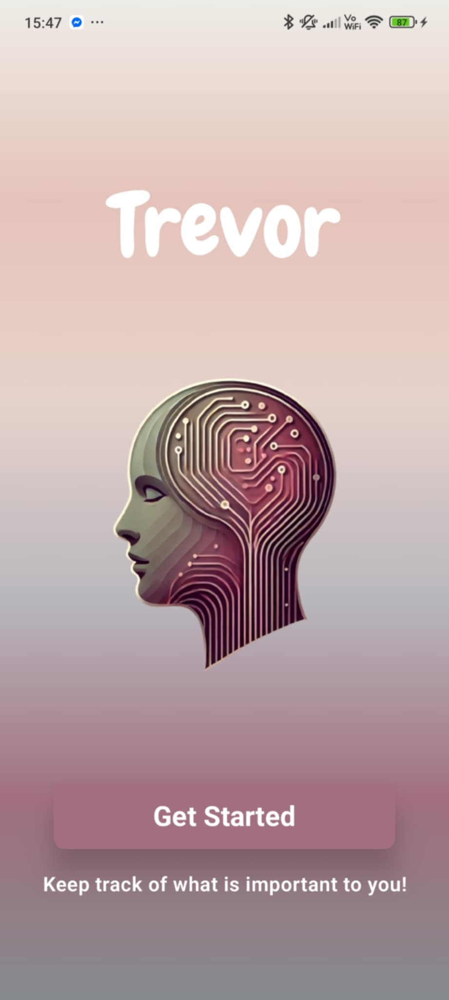
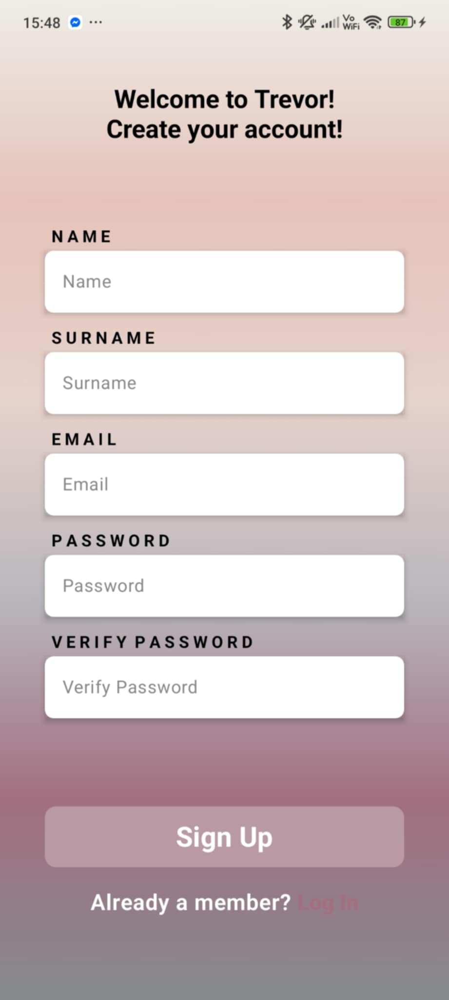
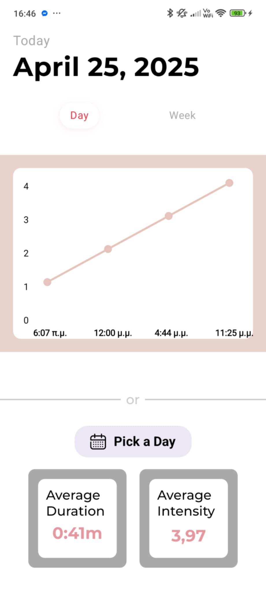
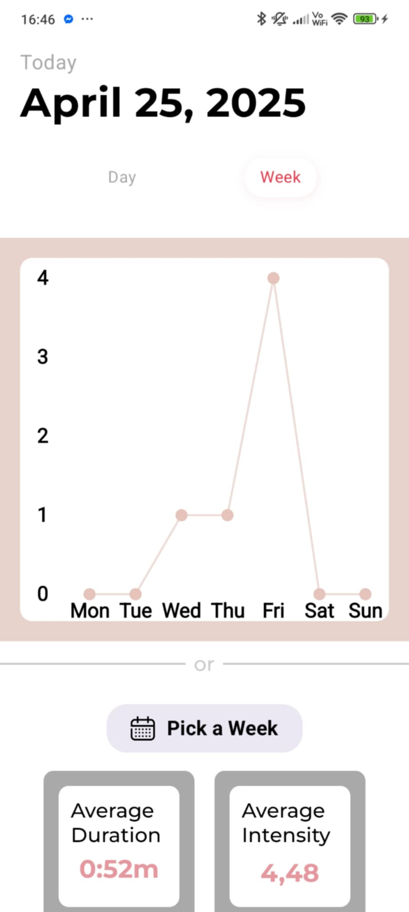
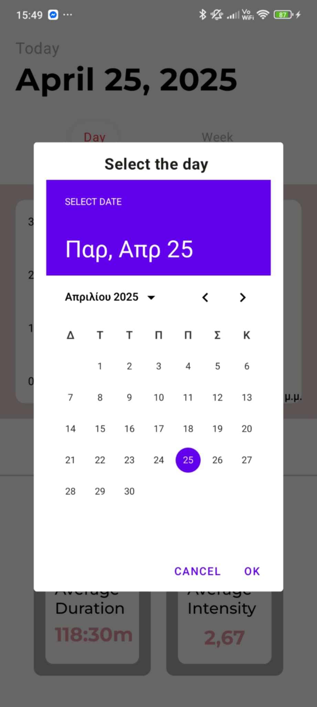
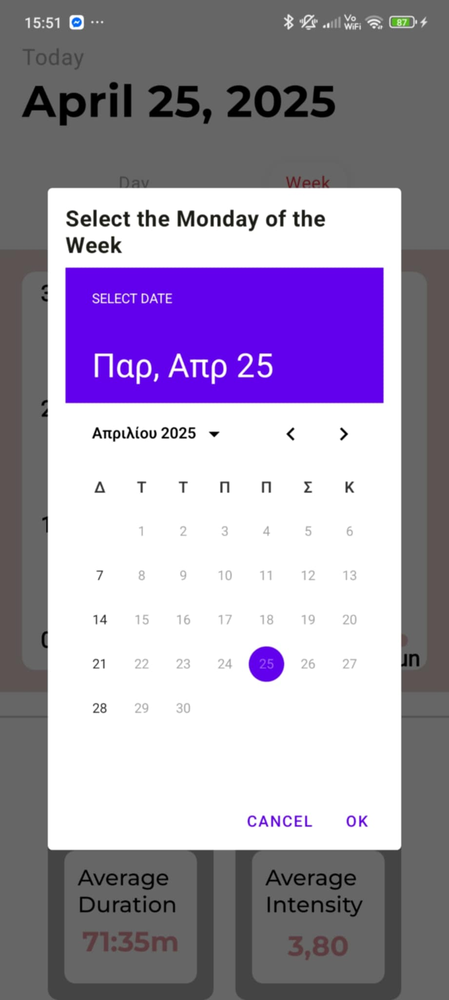

# Trevor: Tremor Detection and User Management System

A cross-platform solution combining a .NET Core backend and an Android client app to detect, store, and analyze tremor events, as well as manage user authentication and profiles.

## 1) Define the Challenge

Epilepsy and other neurological disorders often manifest through tremors that can be quantified and tracked. Early detection and continuous monitoring of tremor intensity and frequency can aid clinicians in diagnosis and treatment decisions. Meanwhile, secure user management is required to ensure patient data integrity and privacy.

**Key objectives:**
- Detect tremor events in real time using a mobile device’s accelerometer.
- Record and analyze tremor duration, intensity, and occurrence patterns over time.
- Provide secure user sign-up and login via a centralized backend service.
- Offer clinicians and users a clear interface for examining tremor history and statistics.

## 2) Collect and Analyze Data

### Tremor Detection Service
- **Sensor Processing:** A foreground Android `Service` subscribes to accelerometer updates, applies a high-pass filter to remove gravity, and uses threshold logic to identify tremor onset and offset.
- **Data Capture:** Records start time, end time, duration, and computed intensity for each tremor event.
- **Local Storage:** Uses SQLite (via `SQLiteOpenHelper`) to persist tremor records in a structured table. Includes helper methods for:
  - Average duration per day
  - Tremor count per day or week
  - Retrieving all events for a specific date

### Data Analysis
- Repository layer (`DatabaseRepositoryImpl`) exposes data queries to the presentation layer.
- Home screen displays charts and summaries of daily/weekly tremor patterns, helping users track progression or triggers.

## 3) Implement Communication Channel

### Backend API (TrevorAPI)
- **Framework:** ASP .NET Core 8.0 Web API with built-in dependency injection.
- **Persistence:** MongoDB for user profiles, credentials, and metadata.
- **Endpoints:**
  - `POST /api/User/login`: Validates `LoginModelForm`, checks password/email, returns user DTO or error.
  - `POST /api/User/SignUp`: Validates `SignUpModelForm`, checks for existing email, creates new user, returns user DTO or conflict.
- **Security & Validation:** Basic `IsValid` checks on incoming JSON; returns HTTP 400/409/500 as appropriate.

### Android Client Networking
- **Retrofit Interfaces (`ApiService`):** Defines HTTP calls matching backend routes.
- **Helper Layer (`ApiHelper`):** Wraps Retrofit calls, maps HTTP status codes to domain exceptions (e.g., `InvalidUserException` on 409).
- **MVVM Integration:** ViewModels handle user input events, call `ApiHelper`, update UI state accordingly.

## 4) Architecture Patterns

### Backend (TrevorAPI)
- **Layered Architecture:** Controllers → Services → Repositories → MongoDB
- **Dependency Injection:** .NET Core DI container injects `IUserService` and `IUserRepository`
- **DTO/Form Separation:** Request models (`Forms/*`) are distinct from domain models (`Model/*`)
- **OpenAPI/Swagger:** Automatic API docs via Swashbuckle.AspNetCore

### Android App
- **MVVM Pattern:** `ViewModel` classes manage UI state; Jetpack Compose Composables observe state and emit events
- **Repository Pattern:** `ApiHelper` (network) and `DatabaseRepositoryImpl` (local) abstract data sources
- **Clean Layering:**
  - **Data Layer:** `data/model`, `data/network`, `data/local`
  - **Domain Layer:** `domain/models`, `domain/repository`
  - **Presentation Layer:** `presentation/*` with state, events, screens
  - **Service Layer:** `TremorDetectionService` for continuous sensor monitoring
- **Navigation:** Jetpack Compose Navigation handles routing between screens

---

## 5) Documentation and User Manual
1. **Setup**:
   - **Backend**: Ensure MongoDB is running; configure `appsettings.json` with connection URI, database name, and collection names. Build and run `TrevorAPI.sln` in Visual Studio or via `dotnet run`.
   - **Android App**: Open the `app/` module in Android Studio; grant `ACTIVITY_RECOGNITION` permission on first launch.

2. **Using the App**:
    - **Get Started** : A welcome screen 

        

   - **Sign Up**: Enter first name, last name, email, and password. On success, you’ll be directed to the Home screen.

        

   - **Login**: Provide registered email and password. Invalid credentials will show an error message.

        

   - **Tremor Monitoring**: Once permission is granted, the app automatically starts the tremor detection service.
   - **Home Screen**: View real-time counts, average durations, and detailed lists of recorded tremors.
  
        
        
        
        

3. **Clinician Dashboard (future)**:
   - Export tremor logs via API for further analysis in external tools.

4. **Troubleshooting**:
   - **Connectivity**: Verify the device can reach the backend URL. Check CORS settings if needed.
   - **Database**: Ensure collections exist in MongoDB; check logs for `Unable to create user` messages.
   - **Sensor Service**: On Android 10+ devices, confirm `ACTIVITY_RECOGNITION` permission is allowed under Settings > Apps.

